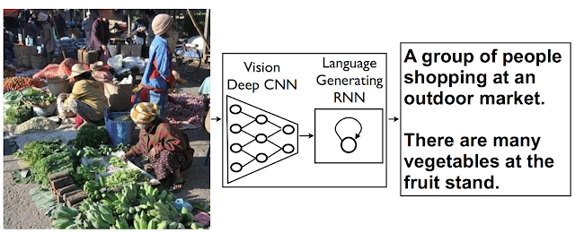

# Descriptor

Descriptor is an Image Captioning autoencoder that uses a Deep Vision CNN Encoder and a Language Generating RNN Decoder to generate a coherent caption for any image.

This is PyTorch implementation of "*Show and Tell: A Neural Image Caption Generator*" [[**arXiv**](https://arxiv.org/abs/1411.4555)] [[**Blog**](https://ai.googleblog.com/2014/11/a-picture-is-worth-thousand-coherent.html?m=1)]



## Getting Started

Before getting started you'll need a few dependencies:

```bash
pip install -r requirements.txt
python setup.py install --user
```

You can train or evaluate the model from the main script:

```bash
python main.py
```